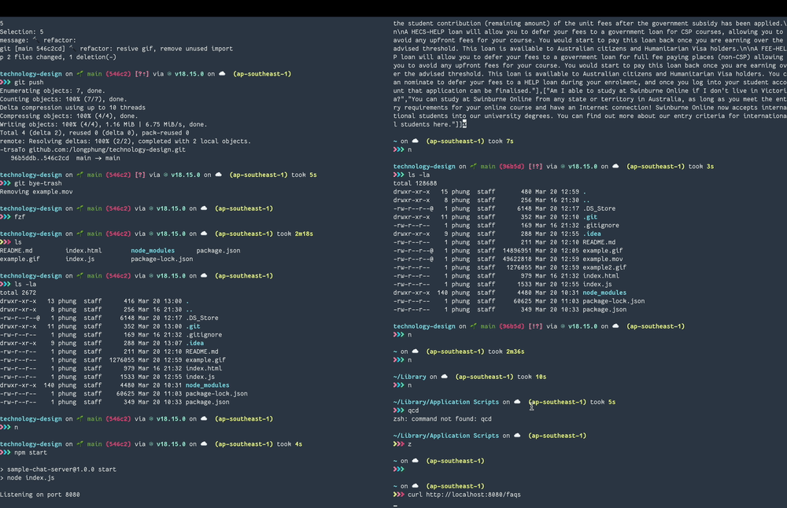
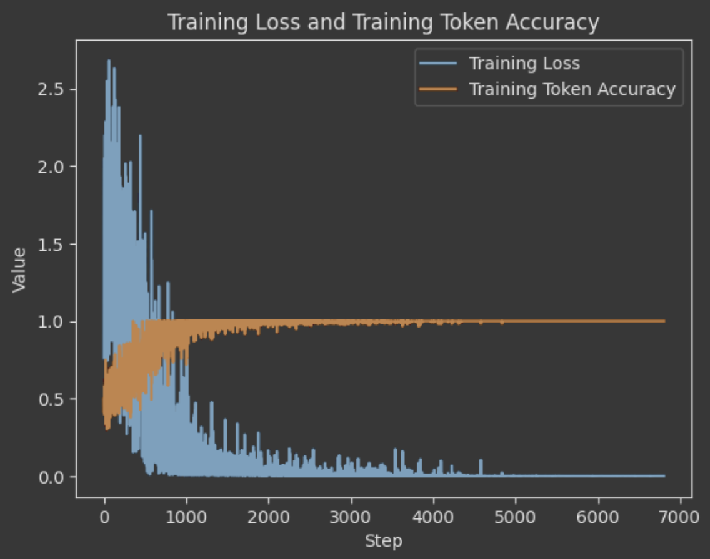

# Swinburne Technology Design Group Project: AI FAQ Answerer

## Contributors
|              |                               |
|--------------|-------------------------------|
| Ashmin Karki | 104081193@student.swin.edu.au |
| Justin Li    | 104138316@student.swin.edu.au |
| Le Vy Cao    | 104201234@student.swin.edu.au |
| Phung Nguyen | 104099316@student.swin.edu.au |
___

## Introduction
Example of fetching faq from Swinburne online.
Attached is example.gif: 

### Requirements:
- Python 3.6+
- Virtualenv (recommended)
- OpenAI API KEY

## Main Project Installation
**Note:** This project uses Python 3.6+. If you have multiple versions of Python installed, you may need to use `python3` and `pip3` instead of `python` and `pip` in the following instructions.
The following steps are instructions for Linux and macOS. If you are using Windows, you may need to adapt these instructions.

1. Clone this repository:

```bash
git clone git@github.com:longphung/technology-design.git
cd technology-design
```

2. Initialize submodule containing client repository:

```bash
git submodule update --init --recursive
```

3. Create a virtual environment and activate it:
[README.md](README.md)
```bash
python3 -m venv venv
source venv/bin/activate  # On Windows, use `venv\Scripts\activate`
```

4. Install the dependencies:

```bash
pip install -r requirements.txt
```

## Usage
The default Flask port is 5000. I had to use 8000 because macOS uses port 5000 for Apple Airplay Receiver.

1. Run the application:

```bash
python app.py
# You need an OpenAI key to be able to run the program set by env OPENAI_API_KEY
# Optionally run your app as:
OPENAI_API_KEY=xxx_your_key python app.py
```

By default, the application will run on localhost with port 8000.
Open a web browser and go to http://localhost:8000 to use the chat interface.
To access the FAQs, go to http://localhost:8000/faqs.

## Development
### Folder Structure
There are 3 main components to this project:
- `app.py`: Main application file.
- `templates/`: HTML templates.
- `labs/`: Jupyter notebooks for testing and model development.

## Model Training Results

For the fintuned davinci model for in-scope generation.
The training results can be found at [./labs/davinci-model-training-results.ipynb](./labs/davinci-model-training-results.ipynb):



For the text prompts used for generating out of scope answers, this prompt was used:

> You are an FAQ chatbot for Swinburne University Online. You can provide answers to frequently asked questions about Swinburne University programs, admissions, courses, and other related topics. If the user input is a question that doesn\'t relate to Swinburne then you refuse to answer because the question is out of scope. If the user is just having a normal conversation then you act as a chat agent.

For the text prompt used to generate questions from the user input, this prompt was used:

> You are an agent performing statement-to-question conversion task. You are not a chatbot agent. You can not respond to the user phrases as if you are a chatbot. You only paraphrase or echo back what the user said. Your prompts will be dry and will only contain the answer. If the user give you a question then you respond with the question. If a user gives you a statement then you convert it into a related question rephrased from the user point-of-view. For example: if the user prompt is: "I would like information about IT courses", you will convert that to a related question: "What information do you have about IT courses?". It must be from the user point-of-view. Write resulting text only

Scope detection model returns a 0.9334 accuracy and 0.944 f1 score when evaluated using tester.csv. This displays good response to 'reasonable' questions reflected by the eval dataset but may not be representative of real world results.
